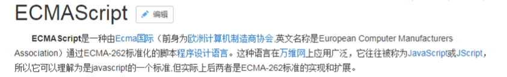
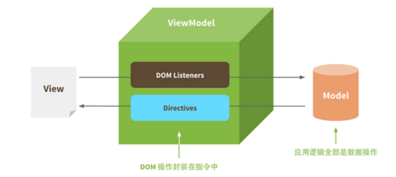

## 00-vuejs 研究

### 一、vue.js 介绍
Vue (读音 /vjuː/，类似于 view) 是一套用于构建用户界面的渐进式框架。与其它大型框架不同的是，Vue 被设计 为可以自底向上逐层应用。Vue 的核心库只关注视图层，不仅易于上手，还便于与第三方库或既有项目整合。另一 方面，当与现代化的工具链以及各种支持类库结合使用时，Vue 也完全能够为复杂的单页应用提供驱动。 

渐进式框架：Progressive，说明vue.js的轻量，是指一个前端项目可以使用vue.js一两个特性也可以整个项目都用 vue.js。

自底向上逐层应用：作为渐进式框架要实现的目标就是方便项目增量开发。

参考：https://cn.vuejs.org/v2/guide/ 

Vue 不支持 IE8 及以下版本，因为 Vue 使用了 IE8 无法模拟的 ECMAScript 5 特性。 

ECMAScript（简称ES）是一种规范，我们平常所说的Js/Javascript是ECMAScript的实现，早期主要应用的ES3，当 前主流浏览器都支持ES5、ES6，ES8已于2017年发布。

ES6：http://www.ecma-international.org/ecma-262/6.0/    
ES7：http://www.ecma-international.org/ecma-262/7.0/    

#### Vue.js的使用 
- 在html页面使用script引入vue.js的库即可使用。
- 使用Npm管理依赖，使用webpack打包工具对vue.js应用打包。大型应用推荐此方案。
- Vue-CLI脚手架。
使用vue.js官方提供的CLI脚本架很方便去创建vue.js工程雏形。 

#### Vue.js的功能
##### 1）声明式渲染
Vue.js 的核心是一个允许采用简洁的模板语法来声明式地将数据渲染进 DOM 的系统。 比如：使用vue.js的插值表达式放在Dom的任意地方， 差值表达式的值将被渲染在Dom中。 

##### 2）条件与循环
dom中可以使用vue.js提供的v-if、v-for等标签，方便对数据进行判断、循环。 

##### 3）双向数据绑定
Vue 提供v-model 指令，它可以轻松实现Dom元素和数据对象之间双向绑定，即修改Dom元素中的值自动修改绑 定的数据对象，修改数据对象的值自动修改Dom元素中的值。 

##### 4）处理用户输入 
为了让用户和你的应用进行交互，我们可以用 v-on 指令添加一个事件监听器，通过它调用在 Vue 实例中定义的 方法

##### 5）组件化应用构建 
vue.js可以定义一个一个的组件，在vue页面中引用组件，这个功能非常适合构建大型应用。 

### 二、vue.js 基础
#### 2.1、MVVM模式
vue.js是一个MVVM的框架，理解MVVM有利于学习vue.js。

- MVVM拆分解释为： - 
  - Model:负责数据存储 
  - View:负责页面展示 
  - View Model:负责业务逻辑处理（比如Ajax请求等），对数据进行加工后交给视图展示 
- MVVM要解决的问题是将业务逻辑代码与视图代码进行完全分离，使各自的职责更加清晰，后期代码维护更加简单 
- 用图解的形式分析Ajax请求回来数据后直接操作Dom来达到视图的更新的缺点，以及使用MVVM模式是如何 来解决这个缺点的
- Vue中的 MVVM

