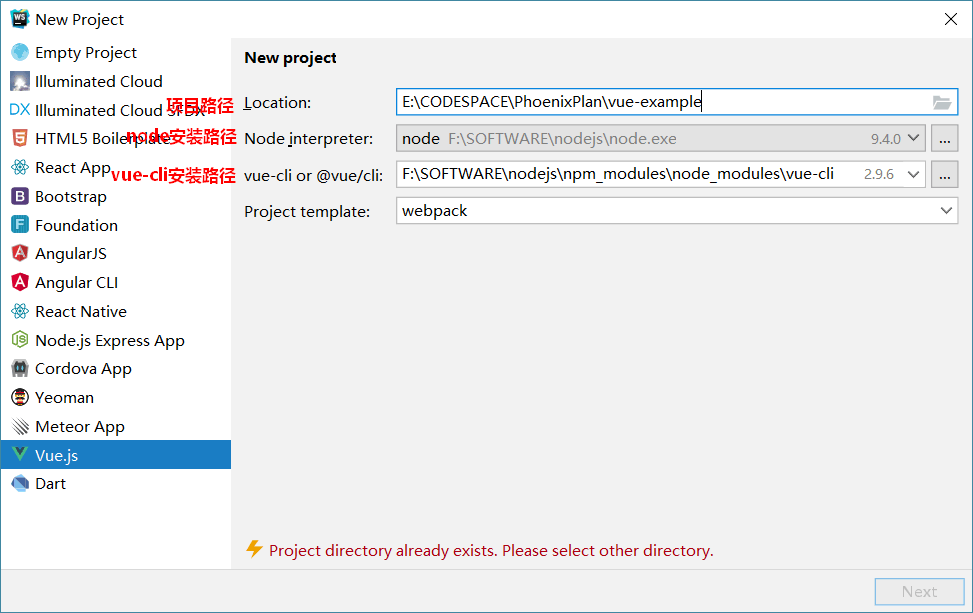
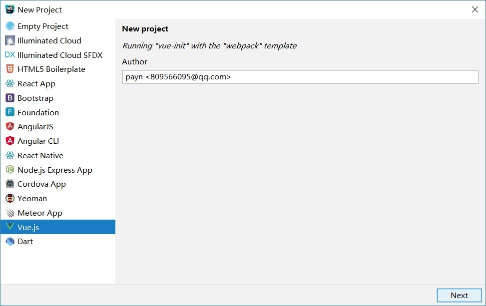
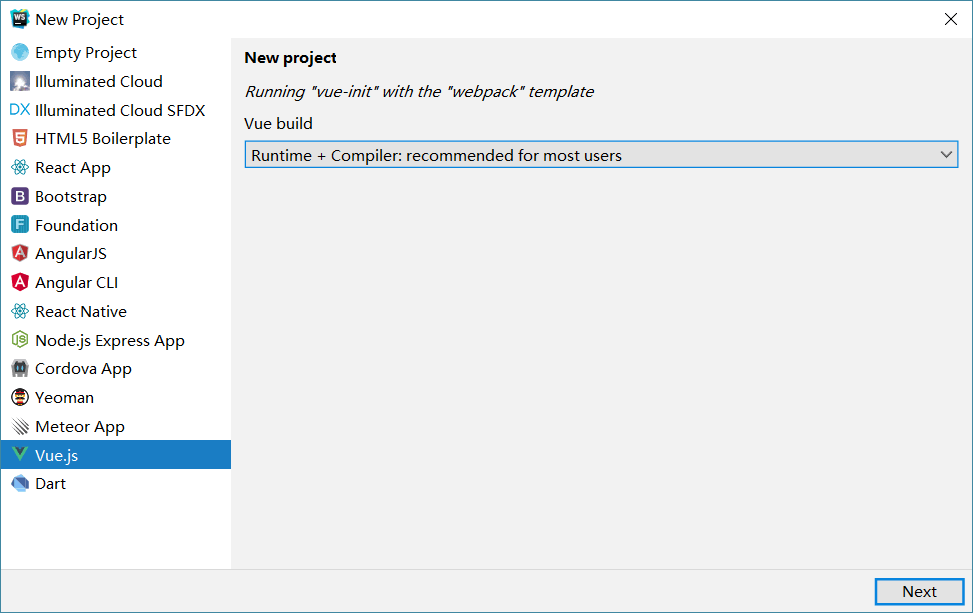
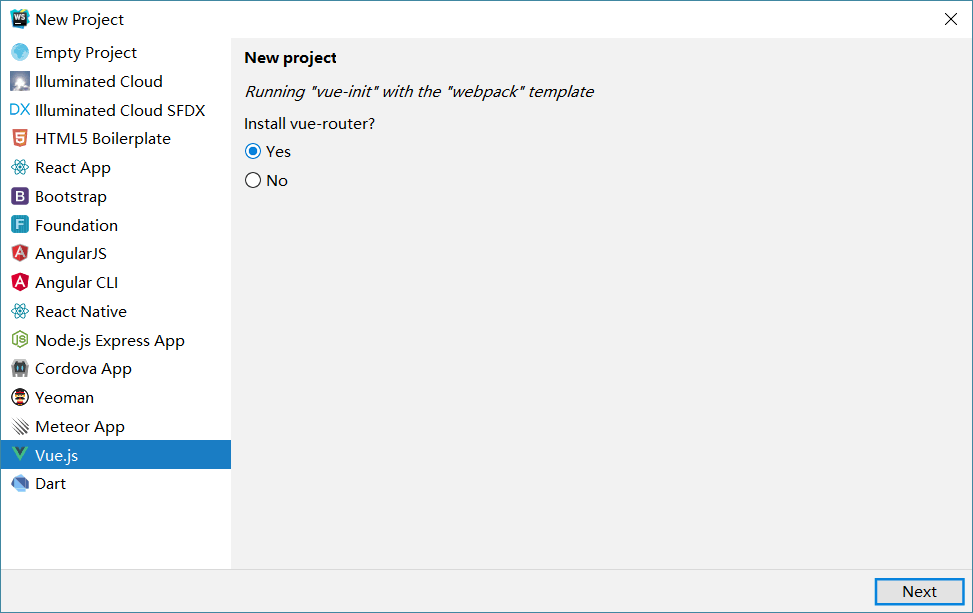

## 01-webstorm创建一个vue项目

### 一、安装node.js

node.js
```
Node.js发布于2009年5月，由Ryan Dahl开发，是一个基于Chrome V8引擎的JavaScript运行环境，使用了一个事件驱动、非阻塞式I/O模型， [1]  让JavaScript 运行在服务端的开发平台，它让JavaScript成为与PHP、Python、Perl、Ruby等服务端语言平起平坐的脚本语言。 [2] 
Node.js对一些特殊用例进行优化，提供替代的API，使得V8在非浏览器环境下运行得更好，V8引擎执行Javascript的速度非常快，性能非常好，基于Chrome JavaScript运行时建立的平台， 用于方便地搭建响应速度快、易于扩展的网络应用。
```

传统意义上的 JavaScript 运行在浏览器上，Chrome 使用的 JavaScript 引擎是 V8，Node.js 是一个运行在服务端 的框架，它的底层就使用了 V8 引擎，这样就可以使用javascript去编写一些服务端的程序，这样也就实现了用 javaScript去开发 Apache + PHP 以及 Java Servlet所开发的服务端功能，这样做的好处就是前端和后端都采用 javascript，即开发一份js程序即可以运行在前端也可以运行的服务端，这样比一个应用使用多种语言在开发效率上 要高，不过node.js属于新兴产品，一些公司也在尝试使用node.js完成一些业务领域，node.js基于V8引擎，基于 事件驱动机制，在特定领域性能出色，比如用node.js实现消息推送、状态监控等的业务功能非常合适。

#### 1.1、下载安装 node.js  
下载：node-v9.4.0-x64.msi
```
https://nodejs.org/zh-cn/   
https://nodejs.org/en/download/
```

验证是否安装成功：v9.4.0
```
node -v  //显示当前node的版本 
```

在系统环境变量中设置：
```
NODE_HOME : F:\SOFTWARE\nodejs

Path中添加：
%NODE_HOME%   
%NODE_HOME%\npm_modules
```

### 二、安装NPM
##### 2.1、自动安装NPM
npm全称Node Package Manager，他是node包管理和分发的工具，使用NPM可以对应用的依赖进行管理，NPM 的功能和服务端项目构建工具maven差不多，我们通过npm 可以很方便地下载js库，打包js文件。 

node.js已经集成了npm工具，在命令提示符输入` npm -v `可查看当前npm版本
```
npm -v 
```

##### 2.2、设置包路径
包路径就是npm从远程下载的js包所存放的路径。 

使用 `npm config ls` 查询NPM管理包路径（NPM下载的依赖包所存放的路径）
```
C:\Users\gravityZero>npm config ls
; cli configs
metrics-registry = "https://registry.npm.taobao.org/"
scope = ""
user-agent = "npm/6.14.8 node/v9.4.0 win32 x64"

; userconfig C:\Users\gravityZero\.npmrc
cache = "F:\\SOFTWARE\\nodejs\\npm_cache"
prefix = "F:\\SOFTWARE\\nodejs\\npm_modules"
registry = "https://registry.npm.taobao.org/"

; node bin location = F:\SOFTWARE\nodejs\node.exe
; cwd = C:\Users\gravityZero
; HOME = C:\Users\gravityZero
; "npm config ls -l" to show all defaults.
```

NPM默认的管理包路径在C:/用户/[用户名]/AppData/Roming/npm/node_meodules，为了方便对依赖包管理，我们将管理包的路径设置在单独的地方，本教程将安装目录设置在node.js的目录下，创建npm_modules和 npm_cache，执行下边的命令： 
```
npm config set prefix "F:\SOFTWARE\nodejs\npm_modules" 
npm config set cache "F:\SOFTWARE\nodejs14\npm_cache"
```
此时再使用 npm config ls 查询NPM管理包路径发现路径已更改。

##### 2.3、安装cnpm 
npm默认会去国外的镜像去下载js包，在开发中通常我们使用国内镜像，这里我们使用淘宝镜像。下边我们来安装cnpm： 

有时我们使用npm下载资源会很慢，所以我们可以安装一个cnmp(淘宝镜像)来加快下载速度。输入命令，进行全局安装淘宝镜像。
```
npm install -g cnpm --registry=https://registry.npm.taobao.org 
```
安装后，我们可以使用以下命令来查看cnpm的版本
```
cnpm -v 
```
如下：
```
C:\Users\gravityZero>cnpm -v
cnpm@6.1.1 (F:\SOFTWARE\nodejs\npm_modules\node_modules\cnpm\lib\parse_argv.js)
npm@6.14.8 (F:\SOFTWARE\nodejs\npm_modules\node_modules\cnpm\node_modules\npm\lib\npm.js)
node@9.4.0 (F:\SOFTWARE\nodejs\node.exe)
npminstall@3.27.0 (F:\SOFTWARE\nodejs\npm_modules\node_modules\cnpm\node_modules\npminstall\lib\index.js)
prefix=F:\SOFTWARE\nodejs\npm_modules
win32 x64 10.0.17134
registry=https://r.npm.taobao.org
```

`nrm ls` 查看镜像已经指向taobao
```
C:\Users\gravityZero>nrm ls
  npm ---- https://registry.npmjs.org/
  cnpm --- http://r.cnpmjs.org/
* taobao - https://registry.npm.taobao.org/
  nj ----- https://registry.nodejitsu.com/
  rednpm - http://registry.mirror.cqupt.edu.cn/
  npmMirror  https://skimdb.npmjs.com/registry/
  edunpm - http://registry.enpmjs.org/
```

使` nrm use XXX `切换镜像

如果nrm没有安装则需要进行全局安装：` cnpm install -g nrm `

##### 2.4、非连网环境安装cnpm 
1）配置环境变量

在系统环境变量中设置：
```
NODE_HOME : F:\SOFTWARE\nodejs

Path中添加：
%NODE_HOME%   
%NODE_HOME%\npm_modules
```

2）找到npm包路径    

根据上边的安装说明npm包路径被设置到了node.js安装目录下的npm_modules目录。可以使用npm config ls查看。

拷贝课程资料中的 npm_modules.zip到node.js安装目录，并解压npm_modules.zip覆盖本目录下的 npm_modules文件夹。 

3）完成上边步骤测试 
```
cnpm -v
```

### 三、安装webpack 
#### 3.1、连网安装
webpack安装分为本地安装和全局安装： 
- 本地安装：仅将webpack安装在当前项目的node_modules目录中，仅对当前项目有效。 
- 全局安装：将webpack安装在本机，对所有项目有效，全局安装会锁定一个webpack版本，该版本可能不适用某个 项目。全局安装需要添加 -g 参数。

进入webpacktest测试目录目录，运行：    
1）本地安装：    
只在我的项目中使用webpack，需要进行本地安装，因为项目和项目所用的webpack的版本不一样。本地安装就会 将webpack的js包下载到项目下的npm_modeuls目录下。 

2）全局安装加-g，如下：    
全局安装就将webpack的js包下载到npm的包路径下。
```
npm install webpack -g 或 cnpm install webpack -g 
```

3）安装webpack指定的版本：   
本教程使用webpack3.6.0，安装webpack3.6.0： 
进入webpacktest测试目录，运行：
```
cnpm install --save-dev webpack@3.6.0
```
全局安装：
```
npm install webpack@3.6.0 -g或 cnpm install webpack@3.6.0 -g 
```

#### 3.2、非连网安装
参考上边 “非连网环境安装cnpm”描述，将课程资料中的 npm_modules.zip到node.js安装目录，并解压 npm_modules.zip覆盖本目录下的npm_modules文件夹。

说明：已执行 “非连网环境安装cnpm”下的操作不用重复执行。

测试：在cmd状态输入webpack，出现如下提示说明 webpack安装成功
```
C:\Users\gravityZero>webpack
No configuration file found and no output filename configured via CLI option.
A configuration file could be named 'webpack.config.js' in the current directory.
Use --help to display the CLI options.
```


### 四、webstorm创建vue项目










