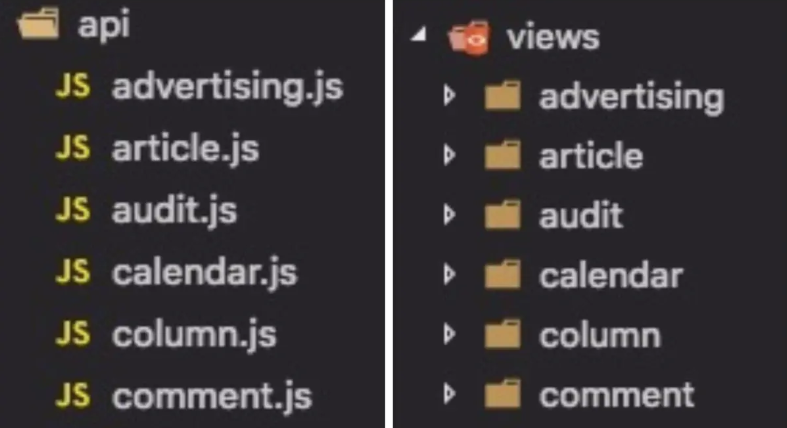
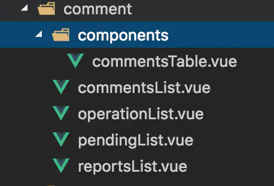

## 02-vue项目结构

目录结构：
```
├── build                      // 构建相关  
├── config                     // 配置相关
├── src                        // 源代码
│   ├── api                    // 所有请求
│   ├── assets                 // 主题 字体等静态资源
│   ├── components             // 全局公用组件
│   ├── directive              // 全局指令
│   ├── filtres                // 全局 filter
│   ├── icons                  // 项目所有 svg icons
│   ├── lang                   // 国际化 language
│   ├── mock                   // 项目mock 模拟数据
│   ├── router                 // 路由
│   ├── store                  // 全局 store管理
│   ├── styles                 // 全局样式
│   ├── utils                  // 全局公用方法
│   ├── vendor                 // 公用vendor
│   ├── views                  // view
│   ├── App.vue                // 入口页面
│   ├── main.js                // 入口 加载组件 初始化等
│   └── permission.js          // 权限管理
├── static                     // 第三方不打包资源
│   └── Tinymce                // 富文本
├── .babelrc                   // babel-loader 配置
├── eslintrc.js                // eslint 配置项
├── .gitignore                 // git 忽略项
├── favicon.ico                // favicon图标
├── index.html                 // html模板
└── package.json               // package.json
```

   
### 一、api和views
这里建议根据业务模块来划分 views，并且 将views 和 api 两个模块一一对应，从而方便维护。如下图：



如 article 模块下放的都是文章相关的 api，这样不管项目怎么累加，api和views的维护还是清晰的，当然也有一些全区公用的api模块，如七牛upload，remoteSearch等等，这些单独放置就行。


### 二、components
放置的都是全局公用的一些组件，如上传组件，富文本等等。




### 三、store
不要为了用 vuex 而用 vuex。

当然有些数据还是需要用 vuex 来统一管理的，如登录token,用户信息，或者是一些全局个人偏好设置等，还是用vuex管理更加的方便，具体当然还是要结合自己的业务场景的。


