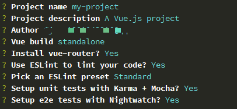
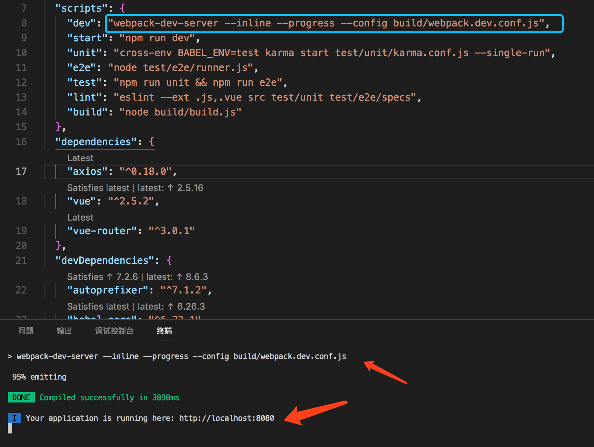

## 04-vue-cli解析

vue-cli 是vue.js的脚手架，用于自动生成vue.js+webpack的项目模板，分为vue init webpack-simple 项目名 和vue init webpack 项目名 两种。

### 一、安装 vue-cli
```
npm install -g vue-cli
```

### 二、使用 vue-cli创建 vue 项目
```
用法： vue init <template-name> <project-name>
 
 template-name:
     . webpack
     . webpack-simple  // 一个简单webpack+vue-loader的模板，不包含其他功能。
     . browserify     //  一个全面的Browserify+vueify 的模板，功能包括热加载，linting,单元检测。
     . browserify-simple  // 一个简单Browserify+vueify的模板，不包含其他功能。
     . pwa           // 基于webpack模板的vue-cli的PWA模板
     . simple      //  一个最简单的单页应用模板  
```
常用的就是webpack
```
vue init webpack my-project
```

执行指令后，会让用户输入几个基本的选项，如图所示


需要注意的是项目的名称不能大写，不然会报错。
```
Project name :项目名称 ，如果不需要更改直接回车就可以了。注意：这里不能使用大写。
Project description:项目描述，默认为A Vue.js project,直接回车，不用编写。
Author：作者，如果你有配置git，他会读取.ssh文件中的user。
Install vue-router? 是否安装vue的路由插件，Y代表安装，N无需安装，下面的命令也是一样的。
Use ESLint to lint your code? 是否用ESLint来限制你的代码错误和风格
setup unit tests with Karma + Mocha? 是否需要安装单元测试工具Karma+Mocha。
Setup e2e tests with Nightwatch?是否安装e2e来进行用户行为模拟测试。
Should we run npm install for you after the project has been created?(recommended)npm
```

根据提示，待模板加载完成之后,执行下面两条命令
```
cd my-project
npm run dev   // dev代表下图框选的内容
```




### 三、文件目录结构

本文主要分析开发（dev）和构建（build）两个过程涉及到的文件，故下面文件结构仅列出相应的内容。
```
|-- build                            // 项目构建(webpack)相关代码
|   |-- build.js                     // 生产环境构建代码
|   |-- check-version.js             // 检查node、npm等版本
|   |-- utils.js                     // 构建工具相关
|   |-- vue-loader.conf.js           // webpack loader配置
|   |-- webpack.base.conf.js         // webpack基础配置
|   |-- webpack.dev.conf.js          // webpack开发环境配置,构建开发本地服务器
|   |-- webpack.prod.conf.js         // webpack生产环境配置
|-- config                           // 项目开发环境配置
|   |-- dev.env.js                   // 开发环境变量
|   |-- index.js                     // 项目一些配置变量
|   |-- prod.env.js                  // 生产环境变量
|   |-- test.env.js                  // 测试脚本的配置
|-- src                              // 源码目录
|   |-- components                   // vue所有组件
|   |-- router                       // vue的路由管理
|   |-- App.vue                      // 页面入口文件
|   |-- main.js                      // 程序入口文件，加载各种公共组件
|-- static                           // 静态文件，比如一些图片，json数据等
|-- test                             // 测试文件
|   |-- e2e                          // e2e 测试
|   |-- unit                         // 单元测试
|-- .babelrc                         // ES6语法编译配置
|-- .editorconfig                    // 定义代码格式
|-- .eslintignore                    // eslint检测代码忽略的文件（夹）
|-- .eslintrc.js                     // 定义eslint的plugins,extends,rules
|-- .gitignore                       // git上传需要忽略的文件格式
|-- .postcsssrc                      // postcss配置文件
|-- README.md                        // 项目说明，markdown文档
|-- index.html                       // 访问的页面
|-- package.json                     // 项目基本信息,包依赖信息等
```

#### 3.1、package.json
package.json文件是项目的配置文件，定义了项目的基本信息以及项目的相关包依赖，npm运行命令等。

scripts 里定义的是一些比较长的命令，用node去执行一段命令，比如
```
"scripts": {
    "dev": "webpack-dev-server --inline --progress --config build/webpack.dev.conf.js",
    "start": "npm run dev",
    "build": "node build/build.js"
  }
```

#### 3.2、dependencies VS devDependencies
```
dependencies 是运行时依赖（生产环境）       npm install --save  **(package name)   
devDependencies 是开发时的依赖（开发环境）  npm install --save-dev  **(package name)
```

#### 3.3、基础配置文件 webpack.base.conf.js
基础的 webpack 配置文件主要根据模式定义了入口出口，以及处理 vue, babel等的各种模块，是最为基础的部分。其他模式的配置文件以此为基础通过 webpack-merge 合并。

webpack.base.conf.js  
webpack.dev.conf.js  
webpack.prod.conf.js  

build.js 编译入口   
实用代码段 utils.js    
babel配置文件.babelrc   
编码规范.editorconfig （自定义）   

src/router/index.js 路由文件
