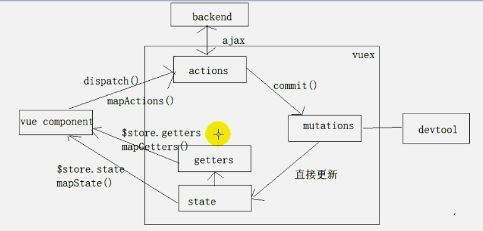

## chapter06-vuex

### 一、vuex理解
#### 1.1、vue是什么
```
github 站点:https://github.com/vuejs/vuex 
在线文档:https://vuex.vuejs.org/zh-cn/
简单来说: 对 vue 应用中多个组件的共享状态进行集中式的管理(读/写)
```

#### 1.2、状态自管理应用
- state: 驱动应用的数据源
- view: 以声明方式将 state 映射到视图 
- actions: 响应在 view 上的用户输入导致的状态变化(包含 n 个更新状态的方法)


#### 1.3、多组件共享状态的问题
- 多个视图依赖于同一状态 
- 来自不同视图的行为需要变更同一状态
- 以前的解决办法 
  - a. 将数据以及操作数据的行为都定义在父组件 
  - b. 将数据以及操作数据的行为传递给需要的各个子组件(有可能需要多级传递) 
- vuex 就是用来解决这个问题的

### 二、vuex 核心概念和 API

#### 2.1、state
1) vuex 管理的状态对象

2) 它应该是唯一的 
```
const state={ xxx:initValue }
```

#### 2.2、mutations
1) 包含多个直接更新 state 的方法(回调函数)的对象     
2) 谁来触发:action 中的 commit('mutation 名称')    
3) 只能包含同步的代码, 不能写异步代码   
```
constmutations={ yyy(state,{data1}){ 
  // 更新 state 的某个属性 
} }
```

#### 2.3、actions
1) 包含多个事件回调函数的对象 
2) 通过执行:commit()来触发 mutation 的调用, 间接更新 state 
3) 谁来触发: 组件中:$store.dispatch('action 名称',data1) //'zzz' 
4) 可以包含异步代码(定时器,ajax) 
```
constactions={ 
  zzz({commit,state},data1){ 
  commit('yyy',{data1}) 
} }
```

#### 2.4、getters
1) 包含多个计算属性(get)的对象 
2) 谁来读取: 组件中:$store.getters.xxx 
```
constgetters={ 
  mmm(state){ 
    return...
  }
}
```

#### 2.5、modules
1) 包含多个 module 
2) 一个 module 是一个 store 的配置对象 
3) 与一个组件(包含有共享数据)对应

#### 2.6、向外暴露 store对象
```
export default new Vuex.Store({
  state,
  mutations,
  actions,
  getters
})
```

#### 2.7、组件中
```
import {mapActions, mapGetters, mapState} from 'vuex'

export default {
  mounted () {
    console.log(this.$store)
  },
  computed: {
    ...mapState(['count']),
    ...mapGetters(['evenOrOdd']) // return this.$store.getters.evenOrOdd
  },
  methods: {
    ...mapActions(['increment', 'decrement', 'incrementIfOdd', 'incrementAsync'])
  }
}
```

#### 2.8、映射 store
```
import Vue from 'vue'
import Counter from './Counter01.vue'
import store from './store'

/* eslint-disable no-new */
new Vue({
  el: '#app',
  components: {
    Counter
  },
  template: '<Counter/>',
  store // 注册上vuex的store: 所有组件对象都多一个属性$store
})
```

#### 2.9、store 对象
- 所有用 vuex 管理的组件中都多了一个属性$store, 它就是一个 store 对象
- 属性: 
  - state: 注册的 state 对象 
  - getters: 注册的 getters 对象 
- 方法: 
  - dispatch(actionName,data): 分发调用 action


#### vuex 结构



